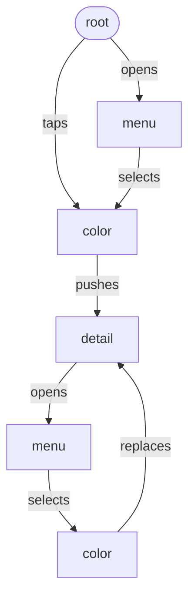

# ContentSwitcherPlayground

This projects shows a way to use a custom container view controller to in-place switch view controllers.

## Resources

* [Creating a custom container view controller](https://developer.apple.com/documentation/uikit/view_controllers/creating_a_custom_container_view_controller)
* [Build with iOS pickers, menus and actions](https://developer.apple.com/wwdc20/10052)
* [Adopting menus and UIActions in your user interface](https://developer.apple.com/documentation/UIKit/adopting-menus-and-uiactions-in-your-user-interface)

